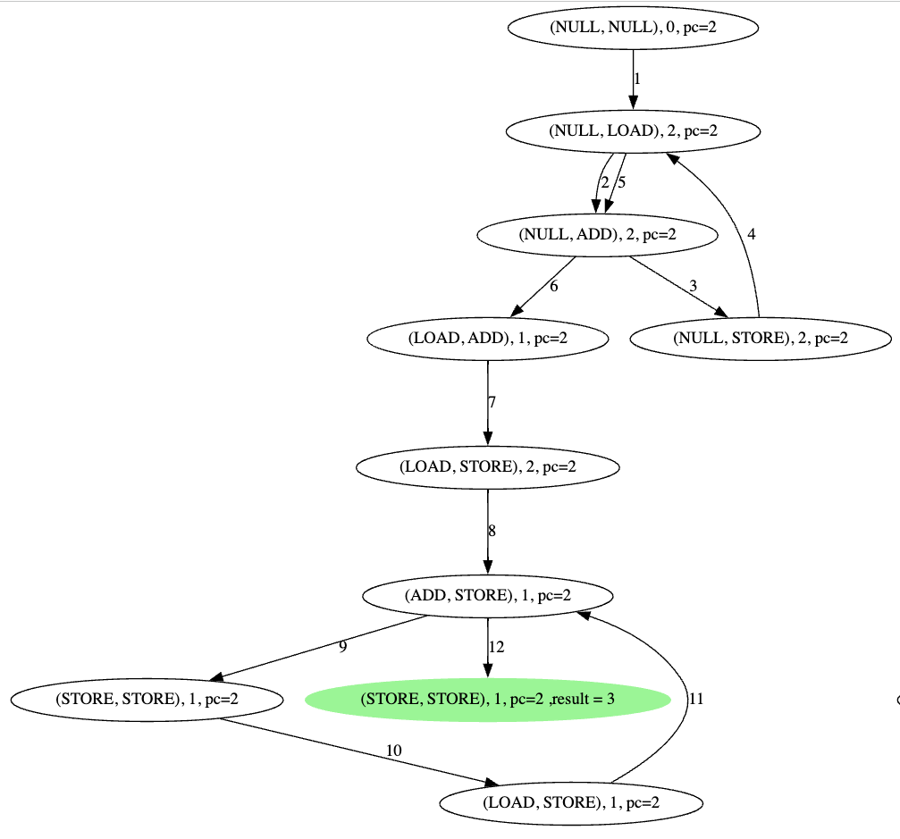

# concurrent-add-checker
a very simple concurrent adding checker !
## 并发程序和问题
测试代码：
```c
#include <stdio.h>
#include <pthread.h>


static int data = 0;

void* add(void* args) {

  for(int i = 0; i < 3; i++) {
    data++;
  }
  return NULL;
}

int main() {
  pthread_t t1, t2;
  pthread_create(&t1, NULL, add, NULL);
  pthread_create(&t2, NULL, add, NULL);
  pthread_join(t1, NULL);
  pthread_join(t2, NULL);
  printf("data = %d\n", data);
  return 0;
}
```
对于上面的程序来说，有两个线程同时执行函数 `add` ，我们可以试想一个问题，上面的程序执行的最终打印 `data` 的结果能够有哪些值？

因为是多个线程同时执行程序我们可以知道最终能够打印出来的值肯定会出现小于顺序执行的和的情况，即（3 + 3 = 6）得到的值肯定会出现 5！现在有一个问题是，这个最小的值会是多少呢？

## 问题分析和状态定义
因为程序执行的情况实在太复杂了，我们无法使用人力的方法去模拟程序的执行，因此我们可以使用程序去模拟整个状态的执行。

首先我们需要知道的是，`data++`  这个操作首先需要在哪从当中加载这个数据，然后在 CPU 中对这个数据进行加一操作，最终将这个数据写回到主存当中。因此 `data++` 操作分为下面三个步骤：

- LOAD，从内存当中加载数据。
- ADD，在 CPU 当中进行加一操作。
- STORE，将 CPU 当中的数据写回到内存当中。

每个线程都是反复执行上面三个步骤，我们只需要去模拟执行所有的情况即可，就能够得到所有的执行结果了。

如果我们使用两个线程同时执行上面的代码的话，两个线程的执行的所有状态如下：
|线程1|线程2|
|----|----|
|NULL|NULL|
|NULL|LOAD|
|NULL|ADD|
|NULL|STORE|
|LOAD|NULL|
|LOAD|LOAD|
|LOAD|ADD|
|LOAD|STORE|
|ADD|NULL|
|ADD|LOAD|
|ADD|ADD|
|ADD|STORE|
|STORE|NULL|
|STORE|LOAD|
|STORE|ADD|
|STORE|STOR|

现在我们知道了所有可能存在的操作状态，现在我们需要去分析这些状态之间是如何转移的，我们需要遵循的准则是：

- LOAD 发生在 ADD 之前。
- ADD  发生在 STORE 之前。
- STORE 之后可以发生 LOAD ，相当于进行下一次 ++ 操作。

现在进行状态的定义：
```python
class State(object):
    NULL  = -1
    LOAD  = 0
    ADD   = 1
    STORE = 2
    maps = {
        -1: "NULL",
        0: "LOAD",
        1: "ADD",
        2: "STORE"
    }

    @classmethod
    def mapping(cls, t):
        return "(" + cls.maps[t[0]]\
                + ", " + cls.maps[t[1]] + ")"

```

根据上面的状态定义和状态对应的数值我们可以分析出来，如果当前的状态为 `(i, j)` 则可以合法转移的状态为 `((i + 1) % 3, (j + 1) % 3)` 。

在模拟程序的执行的时候我们还需要知道一共需要进行多少次 ++ 操作，以及当前的状态已经进行了多少次的 STORE 操作了，当执行的 STORE 操作等于指定的 ++ 操作次数的时候就需要停止递归了（停止状态的搜索）！

除了对 CPU 执行状态的记录，我们还需要对主存中数据和 CPU 当中的缓存数据进行存储，并且当执行指令 LOAD，STORE，ADD 指令的时候对主存和缓存当中的数据进行更新。



|最终和|值的出现次数|比率|
|----|----|----|
|6 |20	| 0.00041135335252982314
|5 |1458	| 0.029987659399424105
|3 |30780	| 0.6330728095433977
|4 |15714	| 0.32320032908268204
|2 |648	| 0.013327848621966268


