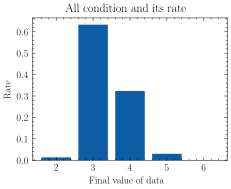

# concurrent-add-checker
a very simple concurrent adding checker !

测试代码：
```c
#include <stdio.h>
#include <pthread.h>


static int data = 0;

void* add(void* args) {

  for(int i = 0; i < 3; i++) {
    data++;
  }
  return NULL;
}

int main() {
  pthread_t t1, t2;
  pthread_create(&t1, NULL, add, NULL);
  pthread_create(&t2, NULL, add, NULL);
  pthread_join(t1, NULL);
  pthread_join(t2, NULL);
  printf("data = %d\n", data);
  return 0;
}
```
对于上面的程序来说，有两个线程同时执行函数 `add` ，我们可以试想一个问题，上面的程序执行的最终打印 `data` 的结果能够有哪些值？

因为是多个线程同时执行程序我们可以知道最终能够打印出来的值肯定会出现小于顺序执行的和的情况，即（3 + 3 = 6）得到的值肯定会出现 5！现在有一个问题是，这个最小的值会是多少呢？

|最终和|值的出现次数|比率|
|----|----|----|----|
|6 |20	| 0.00041135335252982314
|5 |1458	| 0.029987659399424105
|3 |30780	| 0.6330728095433977
|4 |15714	| 0.32320032908268204
|2 |648	| 0.013327848621966268

